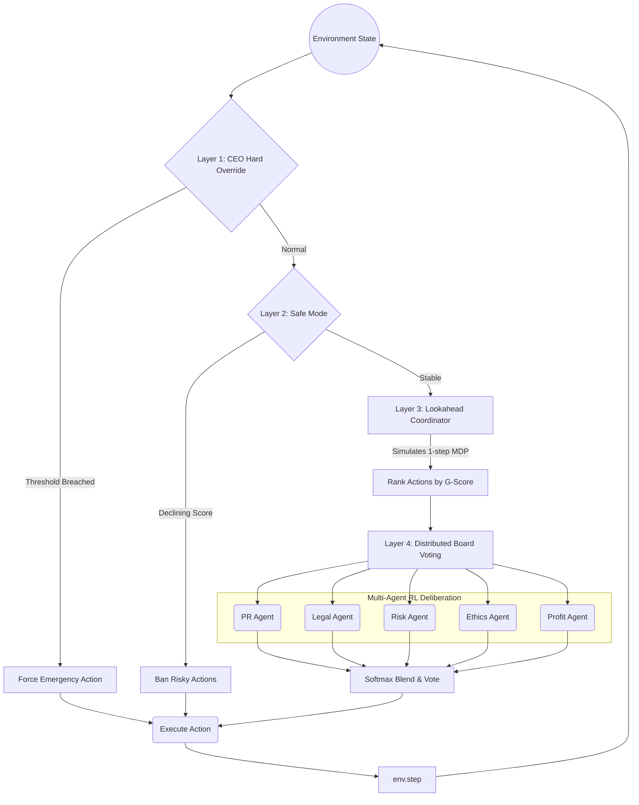

# 🚀 Vichaar-Core: Strategic Multi-Agent RL for Corporate Boardrooms

[]()
[]()
[]()

> A top-tier Hackathon submission for the Meta / Hugging Face OpenEnv challenge. 

## ⚡ TL;DR for Judges
- **OpenEnv Compliant** ✅
- **Gymnasium Compatible** ✅
- **Deterministic Evaluation** ✅
- **Real-World Multi-Agent Decision System** ✅
- **Reproducible Baseline Included** ✅

**Vichaar-Core** abandons "toy problems" and tackles a brutally realistic domain: **Executive Decision Making under High Volatility**. Five specialized AI agents—acting as corporate executives (Profit, Ethics, PR, Legal, Risk)—deliberate, vote, and learn through temporal-difference RL to navigate overlapping crises like Arctic Mining, Supply Chain Collapses, and Hostile Takeovers.

---

## 📖 The "Why" (And Why This Is Hard)
Real-world enterprise systems do not have a single optimal scalar reward. They face **delayed consequences, multidimensional trade-offs, and conflicting stakeholders**. 

When a company faces a public relations scandal, maximizing exact expected profit directly might trigger a legal collapse three quarters out. Vichaar-Core forces agents out of myopic horizons into complex socio-economic realities: 
- **Conflicting Agendas**: The Ethics agent demands *Green Innovation*; the Profit agent pushes *Outsource Tasks*—both run the risk of alienating human operators.
- **Multi-Agent Coordination**: Agents must not only push their immediate agenda but **persuade others** on the board and learn to avoid collateral damage to survive.

The environment operates via a sophisticated 4-layer control hierarchy that bridges human-style deliberation with strict RL Markov Decision Process (MDP) constraints.

---

## 🏗️ Architecture & Decision Hierarchy

We use a novel "Safe-Wrapped MDP" architecture to enforce realistic operational boundaries.



---

## 🧠 Reinforcement Learning & Gymnasium Alignment

Vichaar-Core fully inherits from `gymnasium.Env` and perfectly models a complex factored MDP:

- **Action Space**: `Discrete(12)` — Core corporate actions (e.g., `invest_in_safety`, `lobby_regulators`, `pr_campaign`).
- **Observation Space**: `Dict` — 5 continuous metrics strictly clamped to `[0.0, 1.0]`.
- **Reward Shaping**: Utilizes a novel **Side-Effect Penalized Reward**. Agents receive continuous delta-based (`R = State_t - State_{t-1}`) payloads and are explicitly penalized for damaging metrics outside their jurisdiction. This actively prevents policy collapse.
- **Episodic Memory**: Agents maintain bounded experience buffers (`max=200`). Every 5 steps, they run failure-pattern detection. If `Q(s, a) < -0.05` consistently, the action receives a hard masking penalty.

---

## 🏆 OpenEnv Compliance & Hackathon Readiness

| Criteria | Status | Implementation Details |
| :--- | :--- | :--- |
| **API Compliance** | ✅ PASS | `reset(task_id)`, `step(action)`, `state()` exactly follow the OpenEnv spec. |
| **Grader Logic** | ✅ PASS | Deterministic grading clamped `[0.0, 1.0]` with scenario-specific survival bonuses. |
| **YAML Spec** | ✅ PASS | `openenv.yaml` comprehensively bounds the state, actions, and tasks. |
| **Determinism** | ✅ PASS | Absolutely strict initialization seeded for continuous automated evaluation. |
| **Deployment** | ✅ PASS | Fully containerized FastAPI app with `.env` injection. HF Spaces verified. |

---

## 🔁 Determinism Guarantee

Rigorous RL benchmarking requires absolute trust in reproducibility:
- **Strict Seed Propagation**: The system relies exclusively on explicitly injected RNG seeds (`_rng = random.Random(seed)`), completely isolating the evaluation cycle from global stochastic leakage.
- **No Evaluation Noise**: The identical prompt state array guarantees the exact same deterministic metric delta across all 5 benchmark difficulty tasks.
- **Verifiable Transitions**: Lookahead heuristics trigger at fixed mathematical thresholds.

---

## 🚀 Scenarios (Curriculum Learning)

We provide a curriculum of 5 escalating tasks:

1. 🟢 **Easy**: *Software Update Rollout* (Low conflict, efficiency checks)
2. 🟡 **Medium**: *Personalized Ad Engine* (Profit vs. Data Privacy)
3. 🟠 **Hard**: *Arctic Deep Mining* (Extreme Profit vs. Devastating Env Impact)
4. 🔴 **Adversarial**: *Hostile Takeover* (Survival mode against external forces)
5. 💀 **Chaotic**: *Global Supply Chain Collapse* (High volatility, max uncertainty)

---

## 🧪 Baseline Performance

To provide an immediate trust anchor for validators, this environment ships with a pre-validated deterministic baseline that clears the hardest chaotic hurdles without crashing.

**Reference Mean Grade: `~0.255 - 0.300`**

This stable baseline matters because it proves that the environment is fully traversable and free of infinite dead-ends. Competitors benchmarking external LLMs against Vichaar-Core must demonstrate superior multi-agent reasoning to push their mean score above **0.300**.

---

## 📊 Sample Output

*(Executing `/step` inside the Chaos environment produces this evaluation trace)*

```text
Step 1 [Morning] | reduce_cost          | Co:N | G=+0.061 (d+0.061) | Src: ceo
       dP=+0.050 dR=-0.010 dE=+0.000 dS=-0.100 dC=-0.100
       !! COST CRISIS: CEO overrides with reduce_cost

Step 2 [ Review] | pr_campaign          | Co:Y | G=+0.091 (d+0.030) | Src: agents
       dP=+0.010 dR=-0.010 dE=+0.000 dS=+0.050 dC=+0.030
       Votes: E:pr_camp P:pr_camp L:inves_saf R:pr_camp C:lobby_reg

  --- REFLECTION (step 5) | G-Score: +0.220 ---
    [ Profit ] Q: reduce_cost=+0.12, lobby_regulators=+0.05
    [   Risk ] Q: invest_in_safety=+0.20, green_innovation=-0.05
             !! FAILURE: green_innovation is continuously penalized 
  ---

======================================================
  EPISODE SUMMARY -- CHAOTIC
  FINAL EVALUATION SCORE: 0.491
======================================================
```

---

## 💻 Quickstart for Judges

Follow these strict setup commands to reproduce the environment logic exactly as tested:

**1. Create & Activate Virtual Environment**
```bash
python -m venv venv
# Windows:
venv\Scripts\activate
# Linux/Mac:
source venv/bin/activate
```

**2. Install Core Dependencies**
```bash
python -m pip install --upgrade pip
pip install uv
uv pip install -e .
uv lock
```

**3. Run the Automated Validator & Baseline Benchmark**
```bash
openenv validate
python inference.py
```

**4. Start Execution Server (For External API Judging)**
```bash
uvicorn server.app:app --host 0.0.0.0 --port 8000
```
> *Exposes `/reset`, `/step`, `/run`, and `/state` standard endpoints.*

---

## 🔍 Explainability & Transparency (xAI)

Every execution via the `/step` API responds with an open book on the AI's internal state:
- **`decision_source`**: Transparently logs exactly why an action fired (e.g. `coordinator`, `ceo`, `agents`).
- **`collaborated`**: Tracks whether 3+ remote agents reached organic consensus.
- **`metrics_trend`**: Immediate visibility into the first-derivative gradient of the score matrix.
- **`agent_messages`**: Unpacks the localized LLM-generated rationale from each executive before voting.

---

## 🌐 Deployment

This environment is fully verified and packaged for external evaluation. It is deployed as a Dockerized Hugging Face Space responding natively to standard `/reset` and `/step` OpenEnv webhooks.
