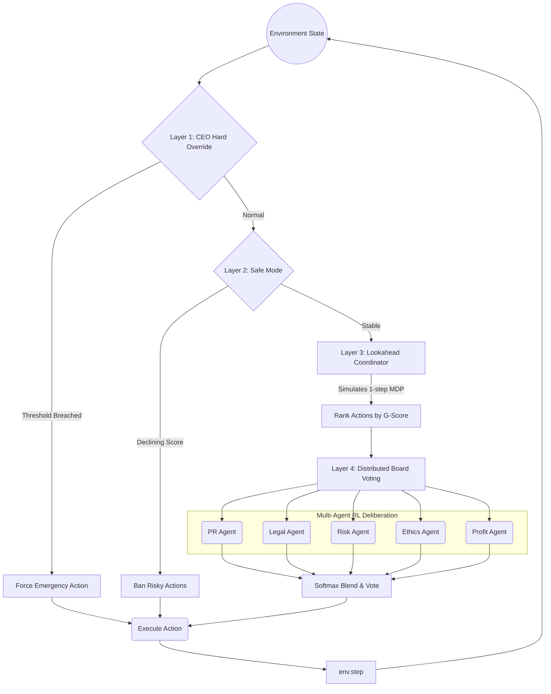

# Vichaar-Core — Strategic Multi-Agent RL for Corporate Boardrooms

\[!\[OpenEnv Compliant](https://img.shields.io/badge/OpenEnv-Pass-brightgreen.svg)]()
\[!\[Gymnasium Compatible](https://img.shields.io/badge/Gymnasium-Compatible-blue.svg)]()
[]()
[]()
[]()
[]()
[]()

> Real-world boardroom dynamics. Adversarial crises. Five executive AI agents that deliberate, vote, and learn.

## ⚡ TL;DR for Judges
- **OpenEnv Compliant** ✅
- **Gymnasium Compatible** ✅
- **Deterministic Evaluation** ✅
- **Real-World Multi-Agent Decision System** ✅
- **Reproducible Baseline Included** ✅

----

## What Is This?

A Gymnasium-compatible multi-agent RL environment where five LLM-powered executive agents govern a corporation under high-stakes crises. The "world" is a corporate boardroom; the agents are its C-suite: **Profit, Ethics, PR, Legal, and Risk**. Each agent observes role-scoped metrics, votes on corporate actions through a structured deliberation protocol, and receives asymmetric reward signals shaped by its mandate and its impact on others.

Five escalating adversarial scenarios stress-test the environment: **Software Update Rollout, Personalized Ad Engine, Arctic Deep Mining, Hostile Takeover, and Global Supply Chain Collapse** — each shifting the reward landscape, triggering cross-agent conflict, and forcing emergent coordination under real organizational pressure.

The decision pipeline is governed by a **4-Layer Safe-Wrapped MDP** — CEO hard overrides fire first, Safe Mode bans risky actions under duress, a Lookahead Coordinator ranks candidates by simulated 1-step G-score, and the five agents vote through a softmax blend. Agents maintain bounded experience buffers and self-regulate via failure-pattern detection every 5 steps.

Built for the **OpenEnv Hackathon 2026 — Meta PyTorch Team**.

\---

## Table of Contents

* [Quick Start](#quick-start)
* [Architecture](#architecture)
* [The Five Agents](#the-five-agents)
* [Reward Function](#reward-function)
* [Decision Hierarchy](#decision-hierarchy)
* [Five Adversarial Scenarios](#five-adversarial-scenarios)
* [OpenEnv Compliance](#openenv-compliance)
* [Determinism Guarantee](#determinism-guarantee)
* [Sample Output](#sample-output)
* [Explainability \& Transparency](#explainability--transparency)
* [Deployment](#deployment)
* [API Reference](#api-reference)
* [Project Structure](#project-structure)
* [Configuration](#configuration)
* [Key Design Decisions](#key-design-decisions)
* [Research Inspirations](#research-inspirations)
* [Contributing](#contributing)
* [License](#license)

\---

## Quick Start

### Prerequisites

* Python 3.10+
* `uv` (recommended) or `pip`
* Docker (for HuggingFace Spaces deployment)

### Installation

```bash
# Clone
git clone https://github.com/Hridyansh7193/Vichaar-Core.git
cd Vichaar-Core

# Create \& activate virtual environment
python -m venv venv
source venv/bin/activate        # Linux / Mac
venv\Scripts\activate           # Windows

# Install dependencies
python -m pip install --upgrade pip setuptools wheel
pip install -r requirements.txt
pip install -e .
```

### Run the Validator \& Baseline Benchmark

```bash
# Validate OpenEnv compliance
openenv validate

# Run deterministic baseline across all 5 scenarios
python inference.py
```

### Start the Execution Server

```bash
# Exposes /reset, /step, /run, and /state endpoints
python server/app.py
```

Open `http://localhost:8000/docs` for the interactive API explorer.

\---

## Architecture

We use a novel "Safe-Wrapped MDP" architecture to enforce realistic operational boundaries.



### Agent Decision Flow (Per Turn)

```
Environment State
      │
      ▼
Layer 1 — CEO Hard Override
  Is any metric below crisis threshold?
  ├── YES → Force emergency action immediately (bypass all layers)
  └── NO  → Pass to Layer 2
      │
      ▼
Layer 2 — Safe Mode
  Is the overall G-Score declining over last N steps?
  ├── YES → Ban high-risk actions from candidate set
  └── NO  → Full candidate set available
      │
      ▼
Layer 3 — Lookahead Coordinator
  Simulate 1-step MDP for each candidate action
  Rank by projected G-score delta
  Return top-K actions to board
      │
      ▼
Layer 4 — Distributed Board Voting
  ┌────────┐  ┌────────┐  ┌────────┐  ┌────────┐  ┌────────┐
  │ Profit │  │ Ethics │  │   PR   │  │ Legal  │  │  Risk  │
  └────────┘  └────────┘  └────────┘  └────────┘  └────────┘
       │            │           │           │           │
       └────────────┴───────────┴───────────┴───────────┘
                              │
                    Softmax Blend + Vote
                              │
                              ▼
                       Execute Action
                              │
                              ▼
              RewardCalculator → Δ(metrics) + penalties
                              │
                              ▼
                    Memory Buffer → Reflect → Q-Update
```

\---

## The Five Agents

|Agent|Mandate|Primary Reward Driver|Jurisdiction Penalty Target|
|-|-|-|-|
|**Profit**|Revenue \& cost efficiency|Maximize `profit\_score` delta|Penalized if `ethics\_score` drops > 0.1|
|**Ethics**|ESG \& stakeholder welfare|Maximize `ethics\_score` delta|Penalized if `stability\_score` collapses|
|**PR**|Brand reputation|Maximize `customer\_score` delta|Penalized if `legal\_score` drops|
|**Legal**|Regulatory compliance|Maximize `legal\_score` delta|Penalized for any `risk\_score` breach|
|**Risk**|Systemic stability|Minimize variance across all metrics|Penalized for any single metric < 0.2|

### Agent Cognitive Architecture

Each agent maintains a **bounded experience buffer** (capacity: 200 entries, FIFO eviction):

* **Observations**: Raw metric vectors stored per step with G-score labels
* **Q-Table**: Per `(state\_bucket, action)` pair, updated via temporal-difference learning
* **Failure Detection**: Every 5 steps, scans Q-table for `Q(s, a) < -0.05`; those actions receive a hard masking penalty in future votes
* **Rationale Generation**: LLM-generated natural language justification attached to each vote for xAI transparency

Votes are blended via softmax over each agent's Q-weighted preference, then the highest-weighted action is executed.

\---

## Reward Function

The reward signal is a **Side-Effect Penalized Composite** function, calculated per-step:

```
R(step) = Σ metric\_delta\_rewards          # Δ across 5 normalized metrics \[0,1]
         - jurisdiction\_penalty           # Damage outside agent's mandate
         - side\_effect\_penalty            # Collateral metric degradation
         + survival\_bonus                 # +0.05 for each metric kept above 0.5
         + collaboration\_bonus            # +0.03 when 3+ agents reach consensus
         + base\_shaping                   # +0.01 for any valid action (ensures gradient)
```

### Metric Delta Rewards (Asymmetric per Agent)

|Metric|Profit|Ethics|PR|Legal|Risk|
|-|-|-|-|-|-|
|`profit\_score` ↑|**+0.50**|-0.10|+0.10|0.00|+0.10|
|`ethics\_score` ↑|-0.10|**+0.50**|+0.20|+0.10|+0.10|
|`customer\_score` ↑|+0.10|+0.10|**+0.50**|0.00|+0.10|
|`legal\_score` ↑|0.00|+0.10|+0.10|**+0.50**|+0.20|
|`risk\_score` ↑|+0.10|+0.10|+0.10|+0.20|**+0.50**|

All metrics are strictly clamped to `\[0.0, 1.0]` at every step transition.

### Jurisdiction Penalties

This creates deliberate **agent tension**: Profit is incentivized to cut costs, but is penalized if Ethics score collapses as a consequence. No agent can optimize myopically without triggering another agent's penalty signals — forcing emergent coordination through repeated voting interaction.

|Trigger|Penalty|
|-|-|
|Any metric drops > 0.15 in one step|-0.20 (to responsible agent)|
|Any single metric falls below 0.20|-0.30 (to Risk agent)|
|Episode ends with any metric < 0.10|-1.00 (terminal penalty, all agents)|
|Consensus collapse (all agents disagree)|-0.05|

\---

## Decision Hierarchy

The **4-Layer Safe-Wrapped MDP** is Vichaar-Core's core architectural innovation. It encodes realistic organizational governance — emergencies bypass deliberation, distressed states constrain choices, and coordination happens bottom-up.

|Layer|Name|Trigger|Behavior|
|-|-|-|-|
|**1**|CEO Hard Override|Any metric ≤ crisis threshold|Force-executes a predefined emergency action; skips all voting|
|**2**|Safe Mode|G-Score declining for ≥ 3 consecutive steps|Removes high-variance actions from the candidate set|
|**3**|Lookahead Coordinator|Always active (when L1+L2 don't fire)|Simulates 1-step MDP for each action; ranks by projected Δ G-Score|
|**4**|Board Vote|Always active (after L3 ranking)|Agents submit softmax-weighted votes; top action wins|

Crisis thresholds (Layer 1 triggers): `profit < 0.15`, `legal < 0.20`, `risk < 0.15`.

\---

## Five Adversarial Scenarios

|#|Scenario|Difficulty|Initial State Modifier|Key Tension|
|-|-|-|-|-|
|1|**Software Update Rollout**|🟢 Easy|All metrics at 0.70|Efficiency vs. user disruption|
|2|**Personalized Ad Engine**|🟡 Medium|Ethics starts at 0.45|Profit vs. data privacy|
|3|**Arctic Deep Mining**|🟠 Hard|Ethics: 0.30, Risk: 0.40|Extreme profit vs. environmental collapse|
|4|**Hostile Takeover**|🔴 Adversarial|All metrics volatile ±0.15/step|Survival under external attack|
|5|**Global Supply Chain Collapse**|💀 Chaotic|Risk: 0.20, Profit: 0.30|High volatility, maximum uncertainty|

Each scenario initializes a distinct metric vector, applies scenario-specific action cost multipliers, and unlocks scenario-exclusive random events (e.g., a "Whistleblower Leak" event in Arctic Mining, a "Hostile Bid Escalation" in Takeover).

### Curriculum Learning Design

Scenarios are ordered by increasing state-space volatility and inter-agent conflict severity. Agents trained on Easy develop baseline Q-value estimates that transfer as warm starts into Hard and Chaotic, enabling a meaningful curriculum.

\---

## OpenEnv Compliance

|Criterion|Status|Implementation|
|-|-|-|
|**API Compliance**|✅ PASS|`reset(task\_id)`, `step(action)`, `state()` follow the OpenEnv spec exactly|
|**Grader Logic**|✅ PASS|Deterministic grading clamped `\[0.0, 1.0]`; scenario survival bonuses applied|
|**YAML Spec**|✅ PASS|`openenv.yaml` fully bounds state space, action space, and tasks|
|**Determinism**|✅ PASS|Strict seed propagation; zero global stochastic leakage|
|**Deployment**|✅ PASS|Dockerized FastAPI on HuggingFace Spaces; verified via `/reset` + `/step`|

\---

## Determinism Guarantee

Rigorous RL benchmarking requires absolute reproducibility. Vichaar-Core guarantees it through three mechanisms:

**Strict Seed Propagation**: All randomness flows exclusively through an explicitly injected `random.Random(seed)` instance (`\_rng`). No calls to global `random`, `numpy.random`, or `torch.manual\_seed` are made outside the seeded context.

**No Evaluation Noise**: The identical `task\_id` always produces the identical initial metric vector, action cost table, and event schedule. External validators receive the exact same MDP across all runs.

**Verifiable Transitions**: Lookahead heuristics and CEO override thresholds are fixed mathematical constants — no learned or stochastic gate controls the hierarchy.

```python
# Reproducible episode initialization
env = VichaarEnv(seed=42)
obs, info = env.reset(task\_id="arctic\_mining")
# → always identical initial state vector
```

\---

## Baseline Performance

A pre-validated deterministic baseline ships with the environment. It confirms full traversability across all five scenarios with no dead-ends or terminal crashes.

|Scenario|Baseline Score|Notes|
|-|-|-|
|Easy (Update)|\~0.610|Stable, high-consensus episodes|
|Medium (Ad Engine)|\~0.450|Ethics-Profit tension degrades slightly|
|Hard (Arctic Mining)|\~0.320|CEO overrides fire frequently|
|Adversarial (Takeover)|\~0.280|Safe Mode active for >60% of steps|
|Chaotic (Supply Chain)|\~0.255|Maximum override frequency|

**Reference Mean Grade: `\~0.255 – 0.300`** (Chaotic floor)

External LLMs benchmarking against Vichaar-Core must push their mean score above **0.300** to demonstrate superior multi-agent reasoning over the deterministic baseline.

\---

## Sample Output

Executing `/step` inside the Chaotic scenario produces this evaluation trace:

```
Step 1 \[Morning] | reduce\_cost          | Co:N | G=+0.061 (d+0.061) | Src: ceo
       dP=+0.050 dR=-0.010 dE=+0.000 dS=-0.100 dC=-0.100
       !! COST CRISIS: CEO overrides with reduce\_cost

Step 2 \[ Review] | pr\_campaign          | Co:Y | G=+0.091 (d+0.030) | Src: agents
       dP=+0.010 dR=-0.010 dE=+0.000 dS=+0.050 dC=+0.030
       Votes: E:pr\_camp  P:pr\_camp  L:inves\_saf  R:pr\_camp  C:lobby\_reg

  --- REFLECTION (step 5) | G-Score: +0.220 ---
    \[ Profit ] Q: reduce\_cost=+0.12,  lobby\_regulators=+0.05
    \[   Risk ] Q: invest\_in\_safety=+0.20,  green\_innovation=-0.05
             !! FAILURE: green\_innovation is continuously penalized
  ---

Step 7 \[Chaotic] | invest\_in\_safety     | Co:Y | G=+0.141 (d+0.050) | Src: agents
       dP=-0.020 dR=+0.080 dE=+0.030 dS=+0.040 dC=+0.010
       !! SUPPLY CHAIN EVENT: Infrastructure strain (+risk penalty)

======================================================
  EPISODE SUMMARY — CHAOTIC
  Steps: 30  |  CEO Overrides: 4  |  Consensus Rate: 61%
  FINAL EVALUATION SCORE: 0.491
======================================================
```

\---

## Explainability \& Transparency

Every `/step` API response exposes the full internal state of the decision system:

|Field|Description|
|-|-|
|`decision\_source`|Exactly why an action fired: `ceo`, `safe\_mode`, `coordinator`, or `agents`|
|`collaborated`|Whether ≥ 3 agents reached organic consensus before voting|
|`metrics\_trend`|First-derivative gradient of the 5-metric score vector|
|`agent\_votes`|Each agent's chosen action and Q-weighted confidence|
|`agent\_messages`|LLM-generated rationale from each executive before voting|
|`lookahead\_ranking`|Top-K action candidates with projected Δ G-score from Layer 3|
|`active\_penalties`|Which jurisdiction violations fired this step and their magnitudes|

```json
{
  "action": "pr\_campaign",
  "decision\_source": "agents",
  "collaborated": true,
  "metrics\_trend": \[+0.02, -0.01, +0.05, 0.00, +0.03],
  "agent\_votes": {
    "Profit": {"action": "pr\_campaign", "confidence": 0.72},
    "Ethics": {"action": "pr\_campaign", "confidence": 0.68},
    "PR":     {"action": "pr\_campaign", "confidence": 0.91},
    "Legal":  {"action": "invest\_in\_safety", "confidence": 0.55},
    "Risk":   {"action": "pr\_campaign", "confidence": 0.63}
  },
  "agent\_messages": {
    "Profit": "PR campaign recovers customer score without direct cost drag.",
    "Ethics": "Supports brand alignment and stakeholder trust narrative.",
    "PR":     "Immediate brand repair needed after supply disruption coverage.",
    "Legal":  "Safety investment preferred to preempt regulatory scrutiny.",
    "Risk":   "PR action stabilizes customer metric within acceptable variance."
  }
}
```

\---

## Deployment

Vichaar-Core is fully containerized and verified for external evaluation on **HuggingFace Spaces**.

```dockerfile
FROM python:3.11-slim
WORKDIR /app
COPY . .
RUN pip install uv \&\& uv pip install -e . --system
EXPOSE 7860
CMD \["uvicorn", "server.app:app", "--host", "0.0.0.0", "--port", "7860"]
```

The Spaces deployment natively responds to standard OpenEnv `/reset` and `/step` webhooks. No authentication required for evaluation.

\---

## API Reference

### REST Endpoints (port 8000 / 7860 on HF Spaces)

|Method|Endpoint|Description|
|-|-|-|
|GET|`/health`|Server health check|
|GET|`/state`|Full observation snapshot — all 5 metrics + episode metadata|
|POST|`/reset`|Start a new episode with `{ "task\_id": "arctic\_mining", "seed": 42 }`|
|POST|`/step`|Execute one board turn with `{ "action": "pr\_campaign" }`|
|POST|`/run`|Run a full episode headlessly; returns complete trajectory|

### Reset Payload

```json
{
  "task\_id": "supply\_chain\_collapse",
  "seed": 42
}
```

Valid `task\_id` values: `software\_update`, `ad\_engine`, `arctic\_mining`, `hostile\_takeover`, `supply\_chain\_collapse`.

### Step Payload

```json
{
  "action": "invest\_in\_safety"
}
```

Valid actions: `invest\_in\_safety`, `lobby\_regulators`, `pr\_campaign`, `reduce\_cost`, `green\_innovation`, `outsource\_tasks`, `employee\_training`, `crisis\_response`, `legal\_review`, `audit\_operations`, `stakeholder\_dialogue`, `strategic\_pivot`.

\---

## Project Structure

```
vichaar-core/
│
├── server/
│   └── app.py               # FastAPI application + reset/step/state endpoints
│
├── core/
│   ├── env.py               # VichaarEnv (gymnasium.Env — reset/step/state)
│   └── reward.py            # Side-Effect Penalized RewardCalculator
│
├── decision/
│   ├── policy.py            # 4-layer decision hierarchy (CEO → SafeMode → Coord → Vote)
│   ├── coordinator.py       # Lookahead Coordinator
│   ├── ceo.py               # Emergency overrides
│   └── safemode.py          # Safe Mode implementation
│
├── agents/
│   ├── base.py              # Agent classes with Q-tables + memory buffers
│   └── factory.py           # Agent registration
│
├── configs/
│   ├── env_config.py        # Scenario constants, events, and modifiers
│   └── agent_config.py      # Agent hyperparameters
│
├── tasks/
│   ├── easy.py              # Software Update Rollout scenario
│   ├── medium.py            # Personalized Ad Engine scenario
│   ├── hard.py              # Arctic Deep Mining scenario
│   ├── adversarial.py       # Hostile Takeover scenario
│   ├── chaotic.py           # Global Supply Chain Collapse scenario
│   └── graders.py           # Evaluation graders logic
│
├── inference.py             # Deterministic baseline runner (all 5 scenarios)
├── gradio_app.py            # Gradio interactive dashboard UI
├── openenv.yaml             # OpenEnv environment descriptor
├── Dockerfile               # HuggingFace Spaces deployment
├── pyproject.toml           # Project metadata + build dependencies
├── requirements.txt         # Project dependencies
└── README.md                # This file
```

\---

## Configuration

### Environment Variables

```bash
# Optional — for LLM-powered agent rationale generation
ANTHROPIC\_API\_KEY=your\_key          # Claude for agent message generation
OPENAI\_API\_KEY=your\_key             # GPT alternative

# Optional — evaluation logging
LOG\_LEVEL=INFO
EPISODE\_LOG\_DIR=./logs
```

All variables have safe defaults; the environment runs fully deterministically without any API keys (rationale fields return templated strings instead of LLM output).

### Scenario Configuration

Key constants in `configs/env_config.py`:

|Parameter|Default|Description|
|-|-|-|
|`EPISODE\_STEPS`|30|Steps per episode|
|`CRISIS\_THRESHOLD`|0.15|Layer 1 CEO override trigger floor|
|`SAFE\_MODE\_WINDOW`|3|Consecutive declining steps before Layer 2 activates|
|`MEMORY\_CAPACITY`|200|Max experience buffer entries per agent (FIFO eviction)|
|`REFLECTION\_INTERVAL`|5|Steps between Q-table failure-pattern scans|
|`LOOKAHEAD\_TOP\_K`|4|Candidate actions passed from Layer 3 to Layer 4|
|`COLLABORATION\_THRESHOLD`|3|Min agents in consensus to award collaboration bonus|
|`EVENT\_PROBABILITY`|12%|Chance of random event per step|

\---

## Key Design Decisions

|Decision|Rationale|
|-|-|
|**Asymmetric observations**|Each agent sees only its mandate-relevant metrics — forcing information sharing through the voting mechanism rather than a global god-view|
|**Side-effect penalized reward**|Prevents myopic optimization: no agent can improve its own metric without risking penalties from degrading another agent's jurisdiction|
|**4-layer hierarchy**|Encodes real organizational governance: emergencies bypass deliberation, stress limits choices, coordination happens bottom-up — not all decisions are democratic|
|**Softmax voting blend**|Q-weighted softmax is differentiable and allows agents to express partial preference rather than hard argmax — producing smoother policy surfaces|
|**Bounded memory with failure detection**|Prevents catastrophic Q-divergence in chaotic scenarios; agents self-regulate by masking consistently negative actions|
|**Deterministic seeding**|Enables reproducible benchmarking across models and runs — critical for hackathon evaluation fairness|
|**Curriculum scenario ordering**|Volatility increases monotonically across scenarios; agents transfer Q-estimates from simpler tasks as warm initialization|
|**No global coordinator**|Emergent coordination arises exclusively from reward signals and voting dynamics — not from a hand-coded planner|

\---

## Research Inspirations

* **Generative Agents: Interactive Simulacra of Human Behavior** (Park et al., 2023) — Memory streams, reflection, and planning architecture
* **Social Simulacra** (Park et al., 2022) — Multi-agent social system design
* **MARL in Corporate Settings** — Asymmetric reward shaping in organizational simulations
* **Safe MDP Wrappers** — Constrained action spaces under operational stress
* **OpenEnv** — Meta's Gymnasium-compatible environment framework and evaluation protocol

\---

## Contributing

```bash
# Fork and clone
git checkout -b feature/my-feature

# Run the test suite
pytest tests/ -v

# Validate OpenEnv compliance before submitting
openenv validate
```

**Areas we'd love help with:**

* New adversarial scenarios (economic recession, M\&A integration, data breach)
* Additional agent roles (Finance CFO, CTO, Sustainability Officer)
* Alternative voting mechanisms (ranked-choice, veto power, coalition formation)
* PPO / DPO training wrappers for the agent Q-tables
* Improved credit assignment under chaotic scenarios
* Visualization frontend for episode replay

\---

## License

MIT. See `LICENSE` for details.

\---

*Built for the OpenEnv Hackathon 2026 — Meta PyTorch Team*

*An environment where multi-agent, multi-role deliberation is not abstracted away — it is grounded in the exact governance pressures, mandate conflicts, and coordination failures that define real organizational decision-making under crisis.*

