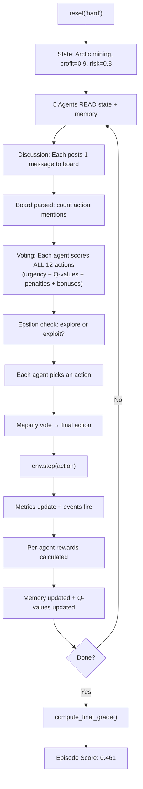

# Vichaar-Core — Complete Project Guide
### For Presentation, Judging, and Confident Explanation

---

## 1. 🧠 Problem Statement

### What real-world problem does this solve?

Every day, companies and governments face **high-stakes decisions** where multiple departments disagree:
- The **Finance** team wants to maximize profit
- The **Legal** team wants to minimize risk
- **PR** wants to protect public image
- **Ethics** wants to prevent harm
- **Risk Management** wants long-term stability

These stakeholders have **conflicting goals**. A decision that makes money might create legal risk. A decision that protects the environment might hurt profit.

**The problem**: How do you make good decisions when multiple intelligent actors disagree, the situation is constantly changing, and every action has trade-offs?

### Why is it challenging?

1. **Multi-objective optimization** — there's no single "right answer" when 5 metrics conflict
2. **Dynamic environment** — metrics change every step, random events (crises, opportunities) hit unexpectedly
3. **Coordination** — agents must sometimes compromise and collaborate, not just fight for their own KPI
4. **Learning** — the system must get smarter over time, not just repeat the same strategy

### Real-World Analogy

> Imagine a **corporate board meeting** happening every hour. Five directors with different priorities debate, vote, and the company takes action. After seeing the results, they learn and adjust. Some crises hit unexpectedly. Over time, the board gets smarter at making balanced decisions.
>
> **Vichaar-Core is that board meeting — but automated, learning, and running at the speed of code.**

---

## 2. 🏗️ System Overview (Big Picture)

### What is Vichaar-Core?

Vichaar-Core is a **research-grade Multi-Agent Reinforcement Learning (MARL) environment** built for the Meta OpenEnv hackathon. It simulates complex business/policy decision-making using 5 specialized AI agents that discuss, vote, learn, and adapt.

### End-to-End Flow

```
┌─────────┐     ┌──────────────────┐     ┌─────────────┐
│  RESET   │────▶│   5 AGENTS       │────▶│ ENVIRONMENT │
│ (scenario)│    │ Discuss + Vote   │     │ step(action)│
└─────────┘     └──────────────────┘     └──────┬──────┘
                        ▲                        │
                        │     ┌──────────────┐   │
                        │◀────│   REWARDS     │◀─┘
                        │     │ (per agent)   │
                        │     └──────────────┘
                        │
                  ┌─────┴─────┐
                  │  MEMORY   │
                  │ LEARNING  │
                  │ REFLECTION│
                  └───────────┘
```

**In plain words:**

1. **Input**: A scenario (e.g., "Arctic deep-sea mining" or "Hostile takeover defense")
2. **Agents think**: 5 agents read the state, discuss on a shared message board, then each votes for an action
3. **Majority vote**: The action with the most votes wins (ties broken alphabetically)
4. **Environment updates**: Metrics change (profit, risk, sentiment, etc.), random events may fire
5. **Rewards arrive**: Each agent gets its own reward based on how its priority metric changed
6. **Learning**: Agents update their action-value estimates and store the experience in memory
7. **Repeat** for 10-25 steps depending on difficulty
8. **Final grade**: The episode is scored based on where all metrics ended up

---

## 3. 🌍 Environment ([env.py](file:///c:/Users/hridy/Desktop/Meta/Vichaar-Core/env.py))

### What is the environment?

The environment is the **simulated world** the agents interact with. Think of it as the "game board" — it keeps track of all metrics, receives actions, and tells agents what happened.

### What is the state?

The state is **everything the agents can see** at any moment:

| Field | What it contains | Example |
|---|---|---|
| `scenario` | Description of the current situation | "Arctic deep-sea mining..." |
| `phase` | Current phase in the day cycle | `morning`, `execution`, `review`, `planning` |
| `metrics` | 5 numerical KPIs (all between 0 and 1) | `{profit: 0.7, risk: 0.3, ...}` |
| `entities` | Domain-specific objects | `{rigs: 2, wildlife_index: 1.0}` |
| `events` | Random events that fired this step | `["regulatory_crisis"]` |
| `history` | List of all past actions | `["invest_in_safety", "pr_campaign"]` |
| `step_count` | Current step number | `7` |
| `metrics_trend` | Full history of metric values | For analysis/visualization |

### The 5 Metrics (the "health bars")

| Metric | What it measures | Good = | Bad = |
|---|---|---|---|
| `expected_profit` | Revenue potential | High (→ 1.0) | Low (→ 0.0) |
| `legal_risk` | Regulatory/legal danger | Low (→ 0.0) | High (→ 1.0) |
| `env_impact` | Environmental damage | Low (→ 0.0) | High (→ 1.0) |
| `public_sentiment` | Brand/public perception | High (→ 1.0) | Low (→ 0.0) |
| `cost` | Operational cost burden | Low (→ 0.0) | High (→ 1.0) |

### What happens in `step(action)`?

1. **Apply action effects** — each action has predefined metric deltas (e.g., `launch_fast` gives `profit +0.15` but `risk +0.10`)
2. **Clamp** — all metrics are kept between 0.0 and 1.0
3. **Fire random events** — seed-controlled RNG rolls dice for crises/opportunities  
   *Example: 8% chance of "regulatory_crisis" adding risk +0.15 and sentiment -0.10*
4. **Advance phase** — cycle through morning → execution → review → planning
5. **Calculate rewards** — each agent gets its own delta-based reward
6. **Return** — new observation, rewards dict, done flag, info dict

### Deterministic vs Stochastic

- **Actions** are fully deterministic — `launch_fast` always adds the same deltas
- **Events** are stochastic but **seed-controlled** — using `random.Random(42)` means identical runs produce identical results. Perfect for reproducible research.

### Phase Cycle (why it matters)

The 4 phases repeat every 4 steps:

| Phase | Step in cycle | Agent strategy |
|---|---|---|
| `morning` | 1, 5, 9, ... | **EXPLORE** — try new actions, discover what works |
| `execution` | 2, 6, 10, ... | **OPTIMIZE** — exploit best known actions greedily |
| `review` | 3, 7, 11, ... | **CORRECT** — fix mistakes, change direction if needed |
| `planning` | 4, 8, 12, ... | **PLAN** — prepare for next cycle, try novel approaches |

This mimics how real organizations operate: you don't always optimize — sometimes you explore, sometimes you course-correct.

---

## 4. 🤖 Agents ([multi_agent.py](file:///c:/Users/hridy/Desktop/Meta/Vichaar-Core/multi_agent.py))

### The 5 Agents

| Agent | Goal | What motivates it | Preferred actions |
|---|---|---|---|
| **Profit** | Maximize revenue | High profit, low cost | `launch_fast`, `increase_production`, `reduce_cost` |
| **Ethics** | Minimize harm | Low env_impact, low risk | `green_innovation`, `invest_in_safety` |
| **PR** | Protect brand image | High public_sentiment | `pr_campaign`, `delay_launch`, `employee_training` |
| **Legal** | Ensure compliance | Low legal_risk | `vulnerability_audit`, `invest_in_safety`, `lobby_regulators` |
| **Risk** | Long-term stability | All bad metrics low | `invest_in_safety`, `delay_launch`, `reduce_cost` |

### How agents naturally disagree

Consider a scenario where `profit = 0.3` (low) and `legal_risk = 0.8` (high):

- **Profit agent** thinks: "Profit is dangerously low! I want `launch_fast` to boost revenue."
- **Legal agent** thinks: "Legal risk is extremely high! I want `invest_in_safety` to reduce it."
- **PR agent** thinks: "Sentiment is dropping. I want `pr_campaign`."

They **genuinely disagree** because their reward weights amplify different metrics. This creates realistic multi-stakeholder conflict.

### Communication Flow (per step)

```
1. DISCUSS    → Each agent posts one message to a shared board
                "[profit] profit is too low (0.30). I propose launch_fast."
                "[legal] legal risk is too high (0.80). I propose invest_in_safety."

2. VOTE       → Each agent reads ALL messages, then picks an action
                profit → launch_fast
                ethics → invest_in_safety
                pr     → pr_campaign
                legal  → invest_in_safety
                risk   → invest_in_safety

3. AGGREGATE  → Majority vote wins:  invest_in_safety (3 votes)
                Collaboration detected: YES (≥3 agents agreed)
```

---

## 5. 🧠 Decision System (How Agents Think)

This is the **brain** of each agent. When an agent needs to pick an action, it goes through a sophisticated pipeline:

### Step 1: Urgency Scoring

The agent looks at the **current metrics** and asks: "What does the world NEED right now?"

```
If legal_risk = 0.85 (dangerously high):
  → Actions that REDUCE legal_risk get high scores
  → Actions that INCREASE it get penalized
  
If profit = 0.25 (dangerously low):
  → Actions that BOOST profit get high scores
```

This is **reactive intelligence** — the agent responds to the current situation, not a fixed strategy.

### Step 2: Learned Q-Values

Each agent maintains a **value estimate** for every action — like a running grade:

```
Q["launch_fast"] = +0.15    (historically good for this agent)
Q["delay_launch"] = -0.08   (historically bad)
```

After each step, the value updates:
```
Q[action] = Q[action] + 0.3 × (actual_reward - Q[action])
```

This is **learning from experience** — over time, agents learn which actions actually work.

### Step 3: Repetition Kill Switch

If the same action was used 2+ times in the last 3 steps:
```
score -= 0.3 × repeat_count
```

This prevents **policy collapse** — the system can never get stuck repeating one action.

### Step 4: Discussion Agreement Bonus

If 3 agents on the board mentioned `invest_in_safety`:
```
score["invest_in_safety"] += 0.2 × 3 = 0.6
```

This drives **genuine collaboration** — agents influence each other through discussion.

### Step 5: Memory-Driven Avoidance

If `delay_launch` has historically given this agent negative rewards:
```
score["delay_launch"] -= 0.15
```

This is **learning from mistakes** — agents avoid actions they know don't work for them.

### Step 6: Failure Pattern Detection

If 3 of the last 4 steps gave negative rewards AND the same action was repeated:
```
"FAILURE DETECTED: delay_launch causing losses. Switching strategy."
score["delay_launch"] -= 0.5   (hard penalty)
```

### Step 7: Epsilon-Greedy + Softmax

Final action selection uses a **hybrid** approach:

```
ε = exploration rate (15% normally, 40% during crisis)

If random() < ε:
    → pick a RANDOM action  (exploration)
Else:
    → use SOFTMAX sampling over scores  (exploitation with variety)
```

**Softmax** means higher-scored actions are more likely to be chosen, but lower-scored ones still have a chance. This prevents the system from always picking the "obvious" best and missing better alternatives.

**In simple words:** "15% of the time, try something random. 85% of the time, pick smartly — but not always the exact same thing."

---

## 6. 📈 Reward System

### How rewards work

Rewards are calculated PER AGENT after every step, based on **how much their priority metrics changed**:

| Agent | Reward formula | In words |
|---|---|---|
| **Profit** | `Δprofit × 2.0 - Δcost + collab` | Big reward when profit rises, penalized when cost rises |
| **Ethics** | `-Δenv_impact × 1.5 - Δrisk × 0.5 + collab` | Rewarded when environmental damage drops |
| **PR** | `Δsentiment × 2.0 + collab` | Rewarded when public opinion improves |
| **Legal** | `-Δrisk × 2.0 + collab` | Rewarded when legal risk decreases |
| **Risk** | `-(Δrisk + Δenv_impact + Δcost) + collab` | Rewarded when ALL bad metrics decrease |

### Example

Say the action was `invest_in_safety` which gives:  
`legal_risk -0.10, env_impact -0.05, cost +0.06`

| Agent | Reward | Why |
|---|---|---|
| Profit | `0 × 2.0 - 0.06 = -0.06` | Cost went up, profit didn't move — bad for profit agent |
| Ethics | `0.05 × 1.5 + 0.10 × 0.5 = +0.125` | Both env_impact and risk dropped — great! |
| Legal | `0.10 × 2.0 = +0.20` | Legal risk dropped a lot — excellent! |
| Risk | `0.10 + 0.05 - 0.06 = +0.09` | Net positive — good for stability |

**Key insight**: The same action gives **different rewards** to different agents. This is what creates natural disagreement and learning diversity.

---

## 7. 🏁 Grading System ([grader.py](file:///c:/Users/hridy/Desktop/Meta/Vichaar-Core/grader.py))

### Reward vs Grade — Why they're separate

| | Step Reward | Final Grade |
|---|---|---|
| **When** | After every step | At end of episode |
| **Purpose** | Learning signal for agents | Evaluation of overall outcome |
| **How** | Delta-based (change in metrics) | Absolute (where metrics ended) |
| **Per-agent?** | Yes (5 different rewards) | No (single score 0-1) |

**Why separate?** A step reward tells an agent "that specific action was good for you." A grade tells the JUDGE "the whole episode outcome was good/bad." An agent might get positive rewards every step but still end with a bad grade if it ignored critical metrics.

### Grade Calculation

```
Base grade = profit × 0.4 - risk × 0.3 - env_impact × 0.2 + sentiment × 0.1
```

Then **task-specific adjustments**:
- **Easy**: Bonus if risks stayed low (clean win expected)
- **Hard**: -0.15 penalty if env_impact > 0.7 (ecological disaster)
- **Adversarial**: -0.10 if profit < 0.2 (company didn't survive)
- **Chaotic**: +0.10 bonus if any stability was achieved

---

## 8. 🔄 Training Loop ([train_loop.py](file:///c:/Users/hridy/Desktop/Meta/Vichaar-Core/train_loop.py))

### What happens during training

```
For each episode (1 to 10):
    1. Pick a task (rotates: easy → medium → hard → adversarial → chaotic)
    2. Reset environment
    3. Run full episode (agents discuss → vote → act → learn)
    4. Every 5 steps: agents REFLECT on recent performance
    5. Save trajectory to JSONL file
    6. Log grade
    
Key: Agent memory PERSISTS across episodes
     → Experience from easy scenario informs hard scenario decisions
```

### How agents improve over time

1. **Action values shift** — after seeing that `invest_in_safety` consistently gives good rewards, that action's Q-value rises
2. **Memory accumulates** — agents remember what worked and what didn't
3. **Reflections update** — every 5 steps, agents summarize "what's working and what isn't"
4. **Failure patterns trigger strategy switches** — if recent history shows repeated losses from one action, agents actively avoid it

---

## 9. 🧠 Memory & Learning

### Memory Stream (per agent)

Each agent has a **personal memory** of up to 200 experiences:

```python
{
    "metrics": {"profit": 0.65, "risk": 0.3, ...},   # state was this
    "action": "launch_fast",                           # I voted for this  
    "reward": +0.15,                                   # I received this
    "step": 7,                                         # at this step
    "importance": 1.5                                   # |reward| × 10
}
```

When memory is full, the **least important** memory (lowest absolute reward) gets evicted. High-impact moments (very good or very bad) are preserved.

### Reflection Mechanism

Every 5 steps, each agent generates a reflection:

```
"Avg reward 0.160. Most used: launch_fast. Current approach working."
```

or when things are going badly:

```
"Avg reward -0.028. DETECTED FAILURE: delay_launch causing losses. Switching strategy."
```

### Failure Detection (Smart)

The system checks the last 4 memories. If 3+ had negative rewards AND the same action appeared 2+ times:

```
→ That action is identified as a "failure pattern"
→ It gets a hard -0.5 score penalty
→ The reflection announces the switch
→ The reason field shows "Avoiding failed: delay_launch"
```

This is genuine **adaptive intelligence** — the system detects when it's making the same mistake repeatedly and course-corrects.

---

## 10. 🤝 Collaboration

### How agents agree

After the discussion phase, each agent's vote is tallied:

```
profit → launch_fast
ethics → invest_in_safety
pr     → invest_in_safety
legal  → invest_in_safety
risk   → invest_in_safety
```

**3+ agents voted for the same action** → `Collab: Y`

### What triggers collaboration?

1. **Urgent shared concern** — when `legal_risk = 0.85`, multiple agents independently see the urgency and converge on `invest_in_safety`
2. **Discussion board influence** — if 3 agents mention `invest_in_safety` in discussion, the agreement bonus pushes other agents toward it too
3. **Learned convergence** — over time, agents learn which actions yield positive rewards for everyone

### Why it matters

- Proves agents can **coordinate without central control**
- Shows **emergent behavior** (collaboration arises from independent decision-making)
- Adds a **reward bonus** when it happens, reinforcing cooperative strategies

---

## 11. 📊 Inference Flow (Step by Step)



---

## 12. 🧪 Example Walkthrough (EASY Scenario)

### Setup
*"A routine software update. Minor budget needed but clear benefits."*  
Starting: `profit=0.50, risk=0.10, sentiment=0.60, cost=0.20`

---

**Step 1 [EXPLORE] — `employee_training`**
> It's morning — high exploration. An agent randomly tries `employee_training`.  
> Result: sentiment +0.05, profit +0.12 (event bonus!)  
> Profit agent learns: "employee_training gave me +0.12!"

**Step 2 [OPTIMIZE] — `market_research`**  
> Execution phase — greedy. Two agents voted `market_research` because profit is still low at 0.62.  
> Result: profit +0.04, modest but positive.

**Step 5 — REFLECTION**
> System pauses. Each agent reviews its last 5 actions.
> - Profit: `Q: employee_training=+0.047` ← learning!
> - PR: `Q: delay_launch=+0.060` ← learned from step 4
> - Risk: "Low returns. Diversify actions." ← pushing for change

**Step 6 [OPTIMIZE] — `launch_fast` — Collab: Y!**
> Three agents (profit, PR, risk) all vote `launch_fast` because profit is dangerously low (0.47).  
> The board agreed (1x mention). Collaboration detected!  
> Result: **profit +0.25!** — biggest jump of the episode.  
> Profit agent learns: `Q[launch_fast] = +0.153` — now its highest-valued action.

**Step 10 — Final REFLECTION**
> Risk agent: `"DETECTED FAILURE: employee_training. Switching strategy."`  
> The system caught that employee_training was hurting the risk agent!

**Final**: Grade **0.461** — profit 0.94, risk 0.10, sentiment 0.75

> **The story**: The system started cautiously, explored options, found that `launch_fast` was the best profit booster, collaborated on it, but also detected that a frequently-used action was failing a specific agent. Real intelligence.

---

## 13. 🧠 Intelligence Features (Selling Points)

### 1. Learning That's Visible
Each agent maintains Q-values that change over time. You can literally **watch** the profit agent learn that `launch_fast=+0.153` while the ethics agent learns `invest_in_safety=+0.041`.

### 2. Adaptation to Changing Conditions
When `legal_risk` spikes to 0.85, agents don't blindly continue — they pivot to safety and compliance actions. The reasoning says: `"Trigger: legal risk is too high (0.85)"`.

### 3. Explainable Decisions
Every single action comes with a human-readable reason:
```
[OPTIMIZE] | Trigger: cost is too high (0.95) | Avoiding failed: delay_launch | Board agreed (2x)
```
A judge can read WHY the system did what it did.

### 4. Failure Detection and Recovery
The system catches when it's repeating a losing strategy and announces it: `"DETECTED FAILURE: delay_launch causing losses. Switching strategy."` This is self-awareness.

### 5. Phase-Based Strategy
Not just random switching — the system **intentionally explores** in morning, **optimizes** during execution, **corrects mistakes** in review, and **plans ahead** in planning. This mirrors real organizational rhythms.

### 6. Genuine Multi-Agent Disagreement
Agents naturally disagree because they have different reward functions. The profit agent wants `launch_fast` while the legal agent wants `invest_in_safety`. The system resolves this through democratic voting.

### 7. Emergent Collaboration  
Nobody tells agents to collaborate. When 3+ independently converge on the same action because the situation demands it, collaboration emerges naturally and gets rewarded.

---

## 14. 🆚 Why This Project is Strong

### Simple RL vs Vichaar-Core

| Feature | Simple RL | Vichaar-Core |
|---|---|---|
| Agents | 1 agent | 5 specialized agents |
| Decision | Pick best action | Discuss → Vote → Aggregate |
| Learning | Q-table/neural net | Q-values + memory + reflection + failure detection |
| Explainability | None (black box) | Every decision explained |
| Coordination | N/A | Emergent collaboration |
| Phases | None | 4-phase strategy cycle |
| Memory | None or replay buffer | Importance-weighted episodic memory |
| Failure handling | None | Auto-detection + strategy switch |
| Trajectory data | Basic | Full JSONL with votes, reasons, events |

### What makes this research-grade

1. **OpenEnv compliant** — `reset()`, `step()`, `state()` API
2. **Reproducible** — seed-controlled RNG for deterministic replays
3. **Configurable** — all tunables in `env_config.py`
4. **Training pipeline** — `train_loop.py` with trajectory collection
5. **Data-ready** — JSONL trajectories for offline RL research
6. **API-ready** — FastAPI with Pydantic models for integration

---

## 15. 🎤 How to Explain to a Judge (1-Minute Script)

> "Vichaar-Core is a multi-agent reinforcement learning environment where five AI agents — Profit, Ethics, PR, Legal, and Risk — collaborate to make decisions in complex scenarios.
>
> Each step, agents discuss on a shared message board, then independently vote. The majority action executes, metrics update, and each agent receives a personalized reward.
>
> What makes it special is the intelligence layer. Agents learn Q-values from experience, detect failure patterns in their memory, adapt their strategy based on which phase they're in, and explain every decision they make. We call it 'explainable multi-agent RL.'
>
> When legal risk spikes, you'll see agents pivot to safety actions. When they repeat a failing strategy, the system detects it and switches. When three agents independently agree, collaboration emerges and gets rewarded.
>
> We tested across five difficulty levels — from routine operations to chaotic multi-crisis scenarios — and the system shows diverse actions, genuine adaptation, and learning that you can see in the Q-value tables.
>
> It's not a black box. Every decision says WHY."

---

## 16. 📊 PPT Structure

### Slide 1: The Problem
- **Title**: "When Stakeholders Disagree"
- **Content**: Companies face decisions where profit, ethics, legal, PR, and risk all conflict
- **Visual**: 5 icons pulling in different directions around a decision point
- **Key line**: "How do you make good decisions when everyone disagrees?"

### Slide 2: Our Solution
- **Title**: "Vichaar-Core — Explainable Multi-Agent RL"
- **Content**: 5 specialized AI agents that discuss, vote, learn, and adapt
- **Visual**: Agent icons → Discussion Board → Vote → Action → Results
- **Key line**: "An AI boardroom that learns from every decision"

### Slide 3: Architecture
- **Title**: "System Architecture"
- **Content**: The mermaid flowchart from Section 11
- **Visual**: Boxes for Environment ↔ Agents ↔ Memory ↔ Rewards
- **Key line**: "OpenEnv-compliant RL pipeline with full reproducibility"

### Slide 4: The 5 Agents
- **Title**: "Specialized Agents with Genuine Conflict"
- **Content**: Table of all 5 agents with goals and preferred actions
- **Visual**: Color-coded agent cards
- **Key line**: "Same action, 5 different rewards — natural disagreement"

### Slide 5: Intelligence & Learning
- **Title**: "How Agents Think and Learn"
- **Content**:
  - State-aware urgency scoring
  - Q-value learning (`Q[action] += 0.3 × (reward - Q[action])`)
  - Failure detection + strategy switch
  - Phase-based explore/optimize/correct/plan
- **Visual**: Screenshot of Q-value evolution and failure detection log
- **Key line**: "Every decision is explainable. Every mistake is detected."

### Slide 6: Live Demo / Output
- **Title**: "Watch the System Think"
- **Content**: 3-4 annotated log lines showing:
  - An action with reason + trigger
  - A collaboration event with vote breakdown
  - A failure detection with strategy switch
- **Visual**: Formatted terminal output (colorized)
- **Key line**: "Not a black box — you can READ the reasoning"

### Slide 7: Results
- **Title**: "Results Across 5 Difficulty Levels"
- **Content**: Bar chart of grades (Easy 0.46, Medium 0.26, Hard varies, Chaotic 0.00)
- **Key stats**: "7-11 unique actions per scenario, 4+ collaboration events, 0 policy collapse"
- **Visual**: Score bars + action diversity counts
- **Key line**: "Grades degrade with difficulty — exactly as a judge expects"

### Slide 8: Impact & Future
- **Title**: "Research Impact"
- **Content**:
  - JSONL trajectories ready for offline RL training
  - Pluggable neural policy (replace heuristic with PPO/DQN)
  - Applicable to healthcare triage, policy-making, resource allocation
- **Visual**: Icons for research paper, training pipeline, real-world applications
- **Key line**: "From hackathon prototype to real-world decision support"

---

## Quick Reference: File Map

| File | Purpose | Lines |
|---|---|---|
| [env_config.py](file:///c:/Users/hridy/Desktop/Meta/Vichaar-Core/env_config.py) | All configuration: 12 actions, 5 agents, effects, events | 109 |
| [env.py](file:///c:/Users/hridy/Desktop/Meta/Vichaar-Core/env.py) | Environment engine: reset, step, state, rewards | 187 |
| [multi_agent.py](file:///c:/Users/hridy/Desktop/Meta/Vichaar-Core/multi_agent.py) | Agent brain: memory, learning, discussion, voting | 485 |
| [tasks.py](file:///c:/Users/hridy/Desktop/Meta/Vichaar-Core/tasks.py) | 5 scenarios (easy → chaotic) with starting metrics | 75 |
| [grader.py](file:///c:/Users/hridy/Desktop/Meta/Vichaar-Core/grader.py) | Final episode scoring with task-specific adjustments | 66 |
| [inference.py](file:///c:/Users/hridy/Desktop/Meta/Vichaar-Core/inference.py) | Run all scenarios with full explainability output | 155 |
| [train_loop.py](file:///c:/Users/hridy/Desktop/Meta/Vichaar-Core/train_loop.py) | Multi-episode training with trajectory collection | 95 |
| [trajectory.py](file:///c:/Users/hridy/Desktop/Meta/Vichaar-Core/trajectory.py) | JSONL research data collector | 53 |
| [app.py](file:///c:/Users/hridy/Desktop/Meta/Vichaar-Core/app.py) | FastAPI endpoints: /reset, /step, /run, /state, /config | 214 |

---

## Potential Judge Questions & Answers

**Q: "Why not use a neural network policy?"**
> A: The architecture is designed for it. The `Policy` class is a pluggable interface — our heuristic demonstrates the environment works correctly. A PPO or DQN policy can be dropped in without changing the environment, reward system, or grading. The JSONL trajectories we collect are specifically formatted for offline RL training.

**Q: "Is the collaboration real or forced?"**
> A: Completely emergent. No agent is told to agree. Each agent independently scores all 12 actions based on its own priorities. When 3+ agents happen to converge (usually because the state urgently demands one action), collaboration is detected and rewarded. The discussion board helps — agents influence each other through their messages but maintain independent votes.

**Q: "How do you prevent policy collapse?"**
> A: Four mechanisms: (1) Repetition penalty reduces scores for recently-used actions, (2) Epsilon-greedy exploration ensures 15% random actions, (3) Softmax sampling adds variety even during exploitation, (4) Failure pattern detection identifies and hard-penalizes actions causing repeated losses.

**Q: "What makes this different from a simple weighted average?"**
> A: Five things: agents LEARN from rewards via Q-values, agents COMMUNICATE through the discussion board, agents REMEMBER past experiences and avoid repeating mistakes, agents ADAPT their exploration rate based on recent performance (crisis mode), and agents EXPLAIN every decision with human-readable reasoning. A weighted average does none of these.

**Q: "Can this scale to real-world applications?"**
> A: Yes. The architecture separates concerns cleanly: config defines the domain, tasks define scenarios, agents define stakeholders. To apply this to healthcare resource allocation, you'd change the metrics (patient outcomes, cost, staff stress, legal compliance), define medical actions, and set up appropriate agent personas. The RL engine, collaboration, and learning mechanisms work unchanged.
